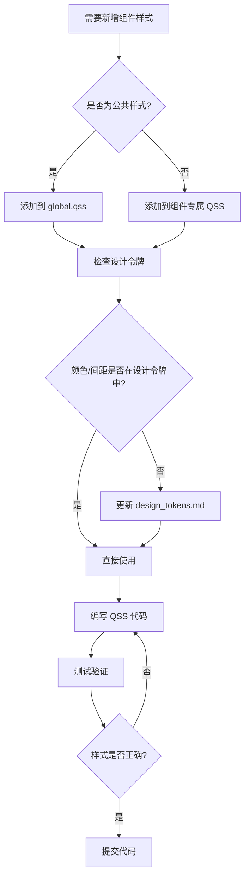

# QChatWidget UI 样式指南

> **版本**: v1.0  
> **更新时间**: 2026-01-27  
> **适用范围**: QChatWidget 所有 UI 组件

---

## 📋 目录

1. [概述](#概述)
2. [设计原则](#设计原则)
3. [组件样式规范](#组件样式规范)
4. [QSS 文件组织](#qss-文件组织)
5. [开发工作流](#开发工作流)
6. [常见问题](#常见问题)

---

## 🎯 概述

本文档是 QChatWidget 项目的 UI 样式开发指南,配合 [`design_tokens.md`](./design_tokens.md) 使用。

### 核心目标

- ✅ **一致性**: 所有组件使用统一的设计令牌
- ✅ **可维护性**: 样式集中管理,易于修改和扩展
- ✅ **可复用性**: 提取公共样式,避免重复代码
- ✅ **规范性**: 遵循命名规范和代码组织规则

---

## 💡 设计原则

### 1. 单一职责原则

每个 QSS 文件只负责一个组件或模块的样式。

**✅ 正确示例**:
```
chat_list.qss       → 只包含 ChatList 相关样式
chat_widget.qss     → 只包含 ChatWidget 相关样式
```

**❌ 错误示例**:
```
styles.qss          → 包含所有组件样式 (太臃肿)
```

### 2. DRY 原则 (Don't Repeat Yourself)

公共样式提取到 `global.qss`,避免在多个文件中重复定义。

**✅ 正确示例**:
```css
/* global.qss */
QPushButton.primary {
    background: #4b7bec;
    border-radius: 12px;
}

/* chat_widget.qss */
#sendButton {
    /* 继承 .primary 样式,只定义特有属性 */
    min-width: 64px;
}
```

**❌ 错误示例**:
```css
/* chat_widget.qss */
#sendButton {
    background: #4b7bec;  /* 重复定义 */
    border-radius: 12px;  /* 重复定义 */
}

/* model_config_import_page.qss */
#importBtn {
    background: #4b7bec;  /* 重复定义 */
    border-radius: 12px;  /* 重复定义 */
}
```

### 3. 优先使用设计令牌

所有颜色、间距、圆角等数值必须来自 [`design_tokens.md`](./design_tokens.md)。

**✅ 正确示例**:
```css
QPushButton {
    background: #4b7bec;      /* 来自 design_tokens.md: primary */
    border-radius: 12px;      /* 来自 design_tokens.md: radius-large */
    padding: 6px 14px;        /* 来自 design_tokens.md: 文字按钮(中) */
}
```

**❌ 错误示例**:
```css
QPushButton {
    background: #5a8bfc;      /* 自定义颜色,未在设计令牌中定义 */
    border-radius: 15px;      /* 自定义圆角,未在设计令牌中定义 */
}
```

---

## 🧩 组件样式规范

### 按钮 (QPushButton)

#### 主要按钮 (Primary Button)

用于主要操作,如"发送"、"导入"。

```css
#sendButton,
#importBtn {
    background: #4b7bec;
    color: white;
    border: none;
    border-radius: 12px;
    padding: 6px 14px;
    font-weight: 500;
    min-width: 64px;
}

#sendButton:hover,
#importBtn:hover {
    background: #3b6fe0;
}

#sendButton:pressed,
#importBtn:pressed {
    background: #2f62d6;
}
```

#### 次要按钮 (Secondary Button)

用于次要操作,如"取消"、"测试"。

```css
#testBtn,
#cancelBtn {
    background: #f4f6f9;
    border: 1px solid #e1e4ea;
    border-radius: 12px;
    padding: 6px 14px;
    font-weight: 500;
    color: #374151;
    min-width: 80px;
}

#testBtn:hover,
#cancelBtn:hover {
    background: #eef2f7;
}

#testBtn:pressed,
#cancelBtn:pressed {
    background: #e2e8f0;
}
```

#### 图标按钮 (Icon Button)

用于图标操作,如"+"、"语音"。

```css
#chatWidgetInputPlusButton,
#chatWidgetInputVoiceButton {
    background: #f4f6f9;
    border: 1px solid #e1e4ea;
    border-radius: 10px;
    padding: 6px 10px;
    color: #374151;
    min-width: 36px;
}

#chatWidgetInputPlusButton:hover,
#chatWidgetInputVoiceButton:hover {
    background: #eef2f7;
}

#chatWidgetInputPlusButton:pressed,
#chatWidgetInputVoiceButton:pressed {
    background: #e2e8f0;
}
```

---

### 输入框 (QLineEdit)

```css
QLineEdit {
    border: 1px solid #d1d5db;
    border-radius: 6px;
    padding: 8px;
    background: #ffffff;
    color: #111827;
}

QLineEdit:focus {
    border: 2px solid #4b7bec;
}
```

**特殊输入框**:

```css
/* 搜索框 */
#chatListSearchBar {
    border: 1px solid #e5e7eb;
    border-radius: 6px;
    padding: 6px 10px;
    background: #f5f5f5;
    color: #333;
    min-height: 34px;
}

/* 透明输入框 (嵌入在输入栏中) */
#chatWidgetInputEdit {
    background: transparent;
    border: none;
    padding: 6px 6px;
    color: #111827;
}
```

---

### 列表 (QListWidget)

```css
QListWidget {
    background-color: #ffffff;
    border: none;
    outline: none;
}

QListWidget::item {
    height: 40px;
    padding-left: 15px;
    border-radius: 6px;
    margin: 2px 5px;
    color: #4b5563;
}

QListWidget::item:selected {
    background: #eef2ff;
    color: #4f46e5;
    font-weight: bold;
}

QListWidget::item:hover:!selected {
    background: #f3f4f6;
}
```

---

### 菜单 (QMenu)

```css
QMenu {
    background: white;
    border: 1px solid #e5e7eb;
    border-radius: 10px;
    padding: 6px;
}

QMenu::item {
    padding: 8px 12px;
    border-radius: 6px;
}

QMenu::item:selected {
    background: #e9f1ff;
}
```

---

## 📁 QSS 文件组织

### 目录结构

```
resources/styles/
├── global.qss                    # 全局基础样式
├── components/                   # 【未来扩展】组件样式目录
│   ├── button.qss               # 按钮通用样式
│   ├── input.qss                # 输入框通用样式
│   └── menu.qss                 # 菜单通用样式
├── chat_list.qss                # ChatList 特有样式
├── chat_widget.qss              # ChatWidget 特有样式
└── model_config_import_page.qss # ModelConfig 特有样式
```

### 文件职责

| 文件                           | 职责                 | 包含内容                           |
| ------------------------------ | -------------------- | ---------------------------------- |
| `global.qss`                   | 全局基础样式         | 通用按钮、输入框、菜单样式         |
| `chat_list.qss`                | ChatList 组件样式    | `#chatListWidget` 及其子组件       |
| `chat_widget.qss`              | ChatWidget 组件样式  | `#chatWidgetInputRoot` 及其子组件  |
| `model_config_import_page.qss` | ModelConfig 页面样式 | `#providerList`、`#detailStack` 等 |

### 加载顺序

```cpp
// 1. 先加载全局样式
loadStyleSheet(":/styles/global.qss");

// 2. 再加载组件特有样式
loadStyleSheet(":/styles/chat_widget.qss");
```

---

## 🔧 开发工作流

### 新增组件样式流程



### 修改现有样式流程

1. **定位样式文件**: 根据组件名找到对应的 QSS 文件
2. **检查设计令牌**: 确认修改是否符合设计令牌
3. **影响范围评估**: 如果修改全局样式,需测试所有组件
4. **修改并测试**: 修改后编译运行,视觉验证
5. **更新文档**: 如有必要,更新 `design_tokens.md`

---

## ❓ 常见问题

### Q1: 如何选择使用 ID 选择器还是类选择器?

**A**: Qt QSS 不支持真正的类选择器,但可以使用对象名 (objectName)。

- **ID 选择器** (`#widgetName`): 用于唯一组件
- **类型选择器** (`QPushButton`): 用于所有同类型组件
- **属性选择器** (`QPushButton[class="primary"]`): 需要在 C++ 中设置属性

**推荐做法**:
```cpp
// C++ 代码
sendButton->setObjectName("sendButton");

// QSS 代码
#sendButton {
    /* 样式 */
}
```

---

### Q2: 为什么我的样式没有生效?

**可能原因**:

1. **选择器优先级**: ID 选择器 > 类型选择器
2. **加载顺序**: 后加载的样式会覆盖先加载的
3. **objectName 未设置**: 确保在 C++ 中调用了 `setObjectName()`
4. **QSS 语法错误**: 检查是否有拼写错误或缺少分号

**调试方法**:
```cpp
// 打印当前样式表
qDebug() << widget->styleSheet();

// 临时设置内联样式测试
widget->setStyleSheet("background: red;");
```

---

### Q3: 如何实现暗色主题?

**方案 1**: 创建 `global_dark.qss`,在运行时切换

```cpp
void applyTheme(bool isDark) {
    QString themeFile = isDark ? ":/styles/global_dark.qss" 
                                : ":/styles/global.qss";
    loadStyleSheet(themeFile);
}
```

**方案 2**: 使用 Qt 的 `QPalette` 系统

```cpp
QPalette darkPalette;
darkPalette.setColor(QPalette::Window, QColor(53, 53, 53));
qApp->setPalette(darkPalette);
```

---

### Q4: 如何调试 QSS 样式?

**方法 1**: 使用 Qt Designer 实时预览

**方法 2**: 使用内联样式快速测试
```cpp
widget->setStyleSheet("background: red; border: 2px solid blue;");
```

**方法 3**: 使用 `qDebug()` 打印样式
```cpp
qDebug() << "Current style:" << widget->styleSheet();
```

**方法 4**: 使用 Qt 的 `QStyleSheetStyle` 调试模式
```cpp
qputenv("QT_STYLE_OVERRIDE", "fusion");
```

---

### Q5: 如何处理 QSS 中的图片资源?

**使用 Qt 资源系统**:

```css
QPushButton {
    background-image: url(:/icons/send.png);
}
```

**注意事项**:
- 路径必须以 `:/` 开头
- 图片必须添加到 `.qrc` 文件中
- 支持格式: PNG, JPG, SVG

---

## 📚 参考资料

### 官方文档

- [Qt Style Sheets Reference](https://doc.qt.io/qt-5/stylesheet-reference.html)
- [Qt Style Sheets Examples](https://doc.qt.io/qt-5/stylesheet-examples.html)
- [Qt Style Sheets Syntax](https://doc.qt.io/qt-5/stylesheet-syntax.html)

### 内部文档

- [设计令牌文档](./design_tokens.md)
- [QChatWidget 架构文档](./Agent.md)

### 外部资源

- [Material Design Guidelines](https://material.io/design)
- [Tailwind CSS Color Palette](https://tailwindcss.com/docs/customizing-colors)

---

## 📝 版本历史

| 版本 | 日期       | 变更说明                      |
| ---- | ---------- | ----------------------------- |
| v1.0 | 2026-01-27 | 初始版本,定义 UI 样式开发规范 |

---

## 🤝 贡献指南

如果您发现样式不一致或有改进建议,请:

1. 在 GitHub Issues 中提出
2. 参考本文档和 `design_tokens.md` 提出具体建议
3. 提交 Pull Request 时附上样式截图

---

**维护者**: QChatWidget Team  
**最后更新**: 2026-01-27
